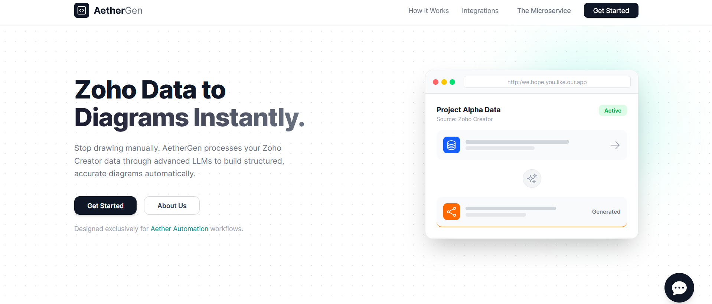
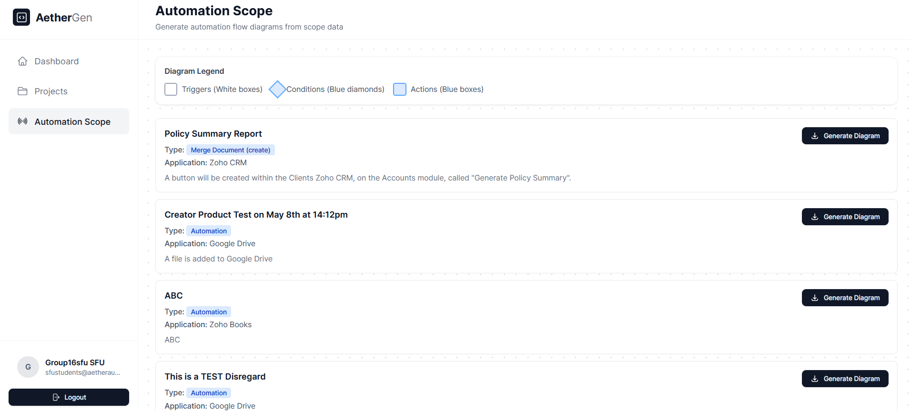
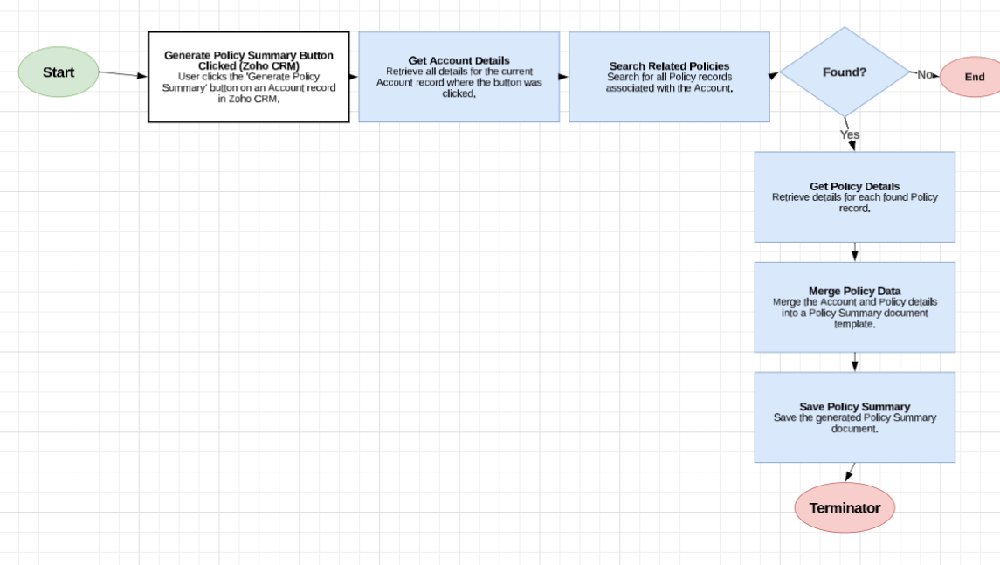

<p align="center">
  <a href="#" target="_blank" rel="noopener noreferrer">
    
  </a>
</p>

<h1 align="center">Lucidchart Generator</h1>

<p align="center">
  <b>AI-Powered Project Diagram Generation</b><br/>
  Convert Zoho Creator data into professional Lucidchart diagrams automatically.
</p>


<p align="center">
  
  
  
</p>

---

## About The Project

Lucidchart Generator is an enterprise solution that automates the creation of system architecture diagrams from structured project data stored in Zoho Creator. Instead of manually recreating project information as diagrams, Lucidchart Generator fetches your data, analyzes it with AI, and generates Lucidchart-compatible XML files ready for import.

**Why Lucidchart Generator?** Project managers and technical teams at Aether Automation spend hours manually recreating project documentation into visual diagrams. This process is error-prone and inconsistent. Lucidchart Generator eliminates manual work by automating the entire pipeline—from data retrieval to diagram generation—ensuring consistency and saving valuable time.

## How It Works

1. **Authenticate Securely**: Sign in with OAuth to access your projects safely
2. **Select a Project**: Choose from a list of projects synced from Zoho Creator
3. **Generate Diagram**: Click "Generate Diagram" to start the AI conversion process
4. **Fetch & Analyze**: The system retrieves project data from Zoho, formats it, and sends it to AI
5. **Receive XML**: Get a Lucidchart-compatible XML file generated from your project data
6. **Import to Lucidchart**: Download the XML and import it directly into Lucidchart to view your diagram

## Quick Start

### Prerequisites

- Docker (recommended)
- Java 17+ and Maven (optional, for local development)

### Installation

Clone and run with Docker:

```bash
git clone <repository-url>
cd Lucidchart-Generator
docker build -t lucidchart-generator .
docker run -p 8080:8080 lucidchart-generator
```

Or build and run locally:

```bash
cd aetherxmlbridge
mvn clean package
./mvn spring-boot:run
```

Open http://localhost:8080 in your browser to get started.

---

## Demo

<p align="center">
  <a href="#" target="_blank" rel="noopener noreferrer">
    
  </a>
</p>

---
<p align="center">
  <a href="#" target="_blank" rel="noopener noreferrer">
    
  </a>
</p>


### Key Features

- **One-Click Generation**: Simple workflow to generate diagrams from project data
- **AI-Powered Conversion**: OpenAI analyzes project structure and creates diagrams automatically
- **Zoho Integration**: Seamlessly fetch organized project information from Zoho Creator
- **Lucidchart Compatible**: Export XML files that import directly into Lucidchart
- **Secure Authentication**: OAuth-based login with session management
- **Real-Time Processing**: Get results immediately after clicking generate

## Features Breakdown

- Users can select from a **List of Projects** fetched directly from Zoho Creator
- System automatically **Normalizes and Structures** project data for AI processing
- AI generates **Lucidchart-Compatible XML** based on project relationships and hierarchy
- Users can **Download** the resulting diagram file
- **Multiple Project Support** with independent diagram generation for each project

---

## Documentation

For detailed project background, technical architecture, and feature specifications, see [aetherxmlbridge/docs/project.md](aetherxmlbridge/docs/project.md).

## License

See the [LICENSE](LICENSE) file for details.
